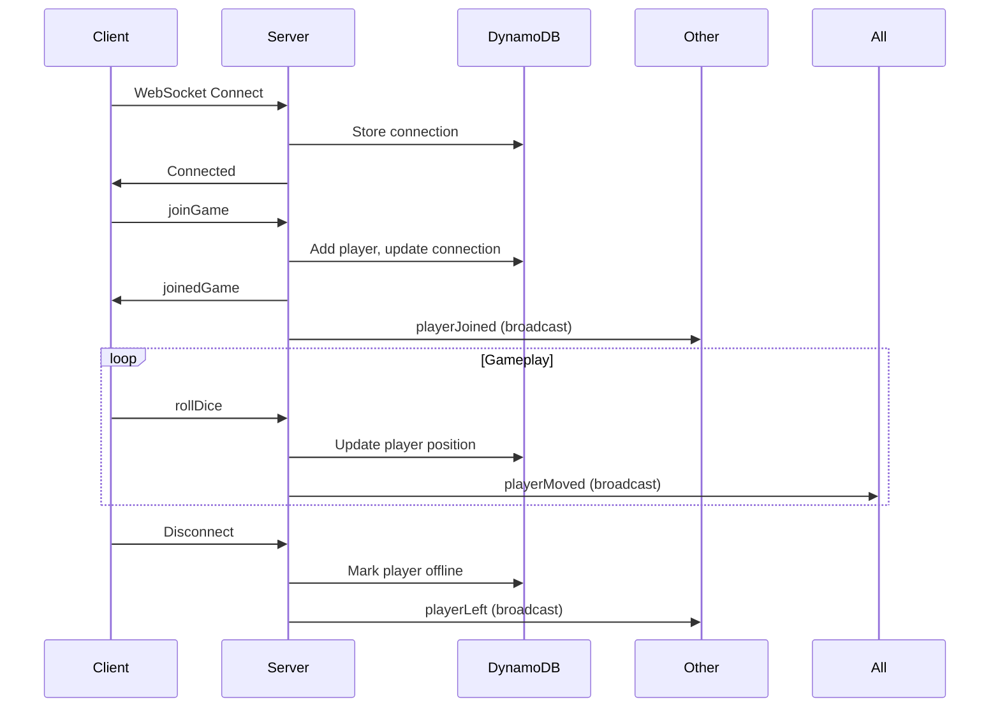

# WebSocket Protocol

## Connection URL

```
wss://{api-id}.execute-api.{region}.amazonaws.com/prod
```

## Client → Server Messages

All messages are JSON with an `action` field.

### Join Game

Join an existing game as a new player.

```json
{
  "action": "joinGame",
  "gameCode": "ABC123",
  "playerName": "Bob"
}
```

### Start Game

Start the game (creator only).

```json
{
  "action": "startGame",
  "gameCode": "ABC123",
  "playerId": "player-uuid"
}
```

### Roll Dice

Roll the dice and move your token.

```json
{
  "action": "rollDice",
  "gameCode": "ABC123",
  "playerId": "player-uuid"
}
```

### Ping

Keep connection alive.

```json
{
  "action": "ping"
}
```

## Server → Client Messages

All messages are JSON with a `type` field.

### Joined Game

Confirmation after successfully joining.

```json
{
  "type": "joinedGame",
  "playerId": "player-uuid",
  "game": { ... },
  "players": [ ... ]
}
```

### Player Joined

Broadcast when another player joins.

```json
{
  "type": "playerJoined",
  "player": {
    "id": "player-uuid",
    "name": "Bob",
    "color": "#EF4444",
    "position": 0,
    "isConnected": true,
    "joinedAt": "2024-01-01T00:00:00Z"
  }
}
```

### Player Left

Broadcast when a player disconnects.

```json
{
  "type": "playerLeft",
  "playerId": "player-uuid",
  "playerName": "Bob"
}
```

### Game Started

Broadcast when the game begins.

```json
{
  "type": "gameStarted",
  "game": {
    "code": "ABC123",
    "status": "playing",
    ...
  }
}
```

### Player Moved

Broadcast after any player's dice roll.

```json
{
  "type": "playerMoved",
  "playerId": "player-uuid",
  "playerName": "Alice",
  "diceRoll": 4,
  "previousPosition": 38,
  "newPosition": 42,
  "effect": null
}
```

With snake/ladder effect:

```json
{
  "type": "playerMoved",
  "playerId": "player-uuid",
  "playerName": "Alice",
  "diceRoll": 3,
  "previousPosition": 4,
  "newPosition": 14,
  "effect": {
    "type": "ladder",
    "from": 7,
    "to": 14
  }
}
```

### Game Ended

Broadcast when someone wins.

```json
{
  "type": "gameEnded",
  "winnerId": "player-uuid",
  "winnerName": "Alice"
}
```

### Error

Sent when an action fails.

```json
{
  "type": "error",
  "code": "GAME_NOT_FOUND",
  "message": "Game not found"
}
```

### Pong

Response to ping.

```json
{
  "type": "pong"
}
```

## Error Codes

| Code | Description |
|------|-------------|
| `GAME_NOT_FOUND` | Game with given code doesn't exist |
| `GAME_FULL` | Game has maximum players |
| `GAME_ALREADY_STARTED` | Cannot join after game started |
| `GAME_NOT_STARTED` | Cannot roll dice before game starts |
| `NOT_GAME_CREATOR` | Only creator can start game |
| `PLAYER_NOT_FOUND` | Player ID not in this game |
| `INVALID_MESSAGE` | Unknown action or malformed JSON |
| `INTERNAL_ERROR` | Server error |

## Connection Lifecycle


