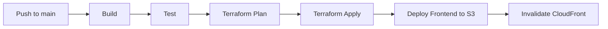

# AWS Infrastructure

## Overview

The game runs on AWS using serverless services managed by Terraform.

## Services Used

### CloudFront + S3

- **Purpose**: Host and serve the React frontend
- **Configuration**:
  - Origin Access Control for secure S3 access
  - HTTPS only with redirect
  - SPA routing (404 → index.html)

### API Gateway

#### WebSocket API

Handles real-time game communication.

| Route | Lambda | Purpose |
|-------|--------|---------|
| `$connect` | ws-connect | Create connection record |
| `$disconnect` | ws-disconnect | Cleanup and notify players |
| `$default` | ws-default | Process game actions |

#### HTTP API

RESTful endpoints for game management.

| Method | Path | Lambda | Purpose |
|--------|------|--------|---------|
| POST | /games | http-create-game | Create new game |
| GET | /games/{code} | http-get-game | Get game state |

### Lambda Functions

All functions use Node.js 20 runtime with ESM modules.

| Function | Memory | Timeout | Purpose |
|----------|--------|---------|---------|
| ws-connect | 256 MB | 30s | Handle WebSocket connections |
| ws-disconnect | 256 MB | 30s | Handle disconnections |
| ws-default | 256 MB | 30s | Process game messages |
| http-create-game | 256 MB | 30s | Create games via REST |
| http-get-game | 256 MB | 30s | Retrieve games via REST |

### DynamoDB

Single table design with on-demand billing.

- **Table Name**: `snakes-and-ladders-{env}`
- **Primary Key**: `PK` (partition), `SK` (sort)
- **GSI1**: For connection and player queries
- **TTL**: Automatic cleanup of old games

## Infrastructure as Code

Terraform modules in `infrastructure/modules/`:

```
modules/
├── api-gateway/     # WebSocket and HTTP APIs
├── dynamodb/        # Table with GSI
├── lambda/          # Function with IAM role
└── s3-cloudfront/   # Frontend hosting
```

## Deployment Pipeline



## Security

### GitHub OIDC

No long-lived AWS credentials. GitHub Actions uses OIDC to assume an IAM role.

### IAM Permissions

Lambda functions have least-privilege access:
- DynamoDB: Specific table only
- API Gateway: Execute API for WebSocket management
- CloudWatch Logs: Own log group only

### Network

- All traffic over HTTPS
- No VPC required (public AWS services)
- API Gateway throttling enabled
