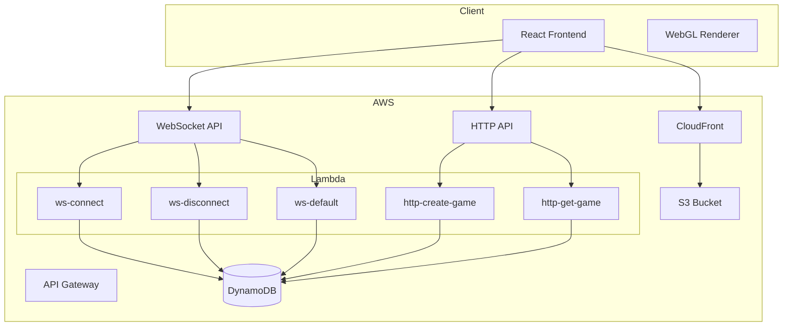

# Architecture Overview

## System Architecture

The Snakes and Ladders game uses a serverless architecture on AWS with a React frontend.

## Components

### Frontend

- **React**: UI components and state management
- **WebGL**: Hardware-accelerated game board rendering
- **Tailwind CSS**: Utility-first styling
- **Vite**: Fast development and optimized builds

### Backend

- **Lambda Functions**: Thin handlers wrapping business logic
- **Business Logic Library**: Testable game, player, and board services
- **DynamoDB Repository**: Data access layer with single-table design

### Real-time Communication

- **WebSocket API**: Bi-directional communication for game events
- **HTTP API**: REST endpoints for game creation and retrieval

## Data Flow

### Creating a Game

1. User enters name and clicks "Create Game"
2. HTTP POST to `/games` endpoint
3. Lambda creates game and player records in DynamoDB
4. Returns game code to frontend
5. Frontend connects to WebSocket and joins game

### Playing the Game

1. Player clicks "Roll Dice"
2. WebSocket message sent to server
3. Lambda processes move, updates DynamoDB
4. Lambda broadcasts result to all connected players
5. All clients update their game state and render

## Design Decisions

### Independent Dice Rolling

Unlike traditional Snakes and Ladders with turns, all players can roll independently. This creates a more dynamic, race-like experience.

### Single Table Design

DynamoDB uses a single table with composite keys to store games, players, and connections. This allows efficient queries and atomic operations.

### Thin Lambda Handlers

Lambda handlers only parse requests and call business logic. All game rules and data access are in testable library code.

### WebGL Rendering

Canvas 2D was considered but WebGL provides:
- GPU-accelerated rendering
- Smooth 60fps animations
- Better performance with many elements
