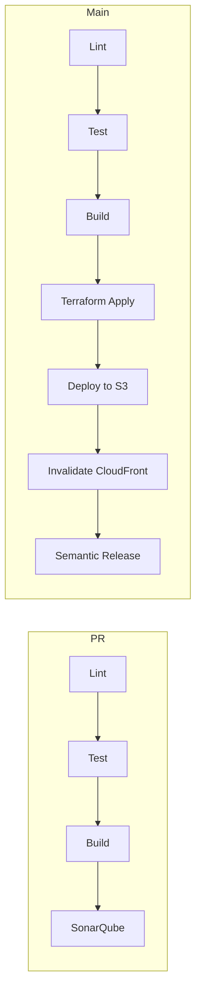

# Deployment

## Overview

Deployment is automated via GitHub Actions with Terraform managing AWS infrastructure.

## CI/CD Pipeline



## Prerequisites

### AWS OIDC Setup

1. Run the OIDC setup Terraform (once, manually):

```bash
cd infrastructure/aws_setup
aws-vault exec personal -- terraform init
aws-vault exec personal -- terraform apply
```

2. Note the output `github_actions_role_arn`

### GitHub Secrets

Set these secrets in your repository:

| Secret | Description |
|--------|-------------|
| `AWS_DEPLOY_ROLE_ARN` | ARN from OIDC setup output |
| `SONAR_TOKEN` | SonarCloud token |
| `SEMGREP_TOKEN` | Semgrep token |

```bash
gh secret set AWS_DEPLOY_ROLE_ARN
gh secret set SONAR_TOKEN < ~/.ssh/sonar_token
gh secret set SEMGREP_TOKEN < ~/.ssh/semgrep_token
```

## Manual Deployment

### Infrastructure

```bash
cd infrastructure/environments/dev

# Initialize
aws-vault exec personal -- terraform init

# Plan
aws-vault exec personal -- terraform plan

# Apply
aws-vault exec personal -- terraform apply
```

### Frontend

```bash
# Build
pnpm --filter @snakes-and-ladders/frontend build

# Deploy to S3
aws-vault exec personal -- aws s3 sync packages/frontend/dist/ s3://BUCKET_NAME --delete

# Invalidate CloudFront
aws-vault exec personal -- aws cloudfront create-invalidation --distribution-id DIST_ID --paths "/*"
```

### Backend

Backend Lambdas are deployed via Terraform. The build artifacts are packaged and uploaded automatically.

## Environment Configuration

### Frontend Environment Variables

Create at build time:

```env
VITE_WS_URL=wss://xxx.execute-api.eu-west-2.amazonaws.com/prod
VITE_API_URL=https://xxx.execute-api.eu-west-2.amazonaws.com/prod
```

### Backend Environment Variables

Configured in Terraform:

```hcl
environment_variables = {
  TABLE_NAME         = module.dynamodb.table_name
  WEBSOCKET_ENDPOINT = module.api_gateway.websocket_management_endpoint
}
```

## Rollback

### Infrastructure

```bash
# View state history
terraform state list

# Revert to previous state (use with caution)
terraform apply -target=module.specific_module
```

### Frontend

```bash
# S3 versioning is enabled
# List versions
aws s3api list-object-versions --bucket BUCKET_NAME

# Restore specific version
aws s3api copy-object --bucket BUCKET_NAME --key FILE --copy-source "BUCKET_NAME/FILE?versionId=VERSION_ID"
```

## Monitoring

### CloudWatch Logs

Each Lambda has its own log group:

```
/aws/lambda/snakes-and-ladders-dev-ws-connect
/aws/lambda/snakes-and-ladders-dev-ws-disconnect
/aws/lambda/snakes-and-ladders-dev-ws-default
/aws/lambda/snakes-and-ladders-dev-http-create-game
/aws/lambda/snakes-and-ladders-dev-http-get-game
```

### CloudWatch Metrics

Monitor:

- Lambda invocations and errors
- API Gateway 4xx/5xx responses
- DynamoDB read/write capacity

## Cost Optimization

The serverless architecture scales to zero:

- **Lambda**: Pay per invocation
- **DynamoDB**: On-demand billing
- **S3**: Minimal storage costs
- **CloudFront**: Pay per request

Expected costs for low traffic: ~$1-5/month
